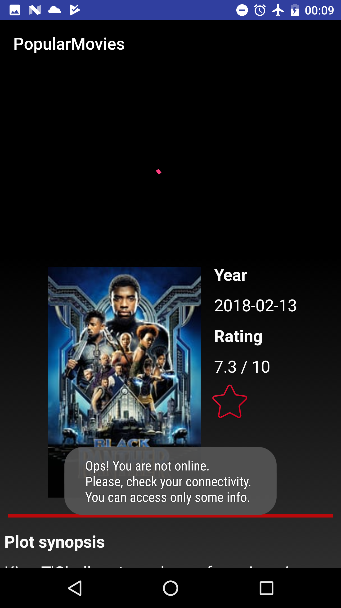
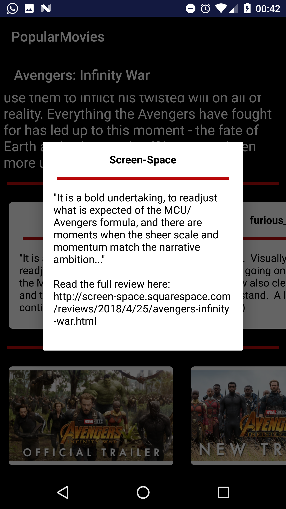

# BakingApp Project

## Project Overview
In this project, I created the **BakingApp** app to show a list of recipes downloeaded from an online json provided by the AND cours, and the recipes details. 

## Aim of this Project
The  app:

- 

## Application screenshot for PopularMovies Stage 2

Here, some screens details.

List of popular, top rated movies selected throw a NavigationDrawer

List favorite movies

Error if no internet connection (except for favorite movies because the movie info are saved)

Error if no internet connection (except for favorite movies because the movie info are saved)

Movie details whent the movie is not between the favorites and when it is

Movie's reviews and trailers

Movie's review detail

### Credits

Icons made by <a href="https://www.flaticon.com/authors/becris" title="Becris">Becris</a> from <a href="https://www.flaticon.com/" title="Flaticon">www.flaticon.com</a> is licensed by <a href="http://creativecommons.org/licenses/by/3.0/" title="Creative Commons BY 3.0" target="_blank">CC 3.0 BY</a>

Icons made by <a href="http://www.freepik.com" title="Freepik">Freepik</a> from <a href="https://www.flaticon.com/" title="Flaticon">www.flaticon.com</a> is licensed by <a href="http://creativecommons.org/licenses/by/3.0/" title="Creative Commons BY 3.0" target="_blank">CC 3.0 BY</a>

Icons made by <a href="https://www.flaticon.com/authors/vitaly-gorbachev" title="Vitaly Gorbachev">Vitaly Gorbachev</a> from <a href="https://www.flaticon.com/" title="Flaticon">www.flaticon.com</a> is licensed by <a href="http://creativecommons.org/licenses/by/3.0/" title="Creative Commons BY 3.0" target="_blank">CC 3.0 BY</a>
