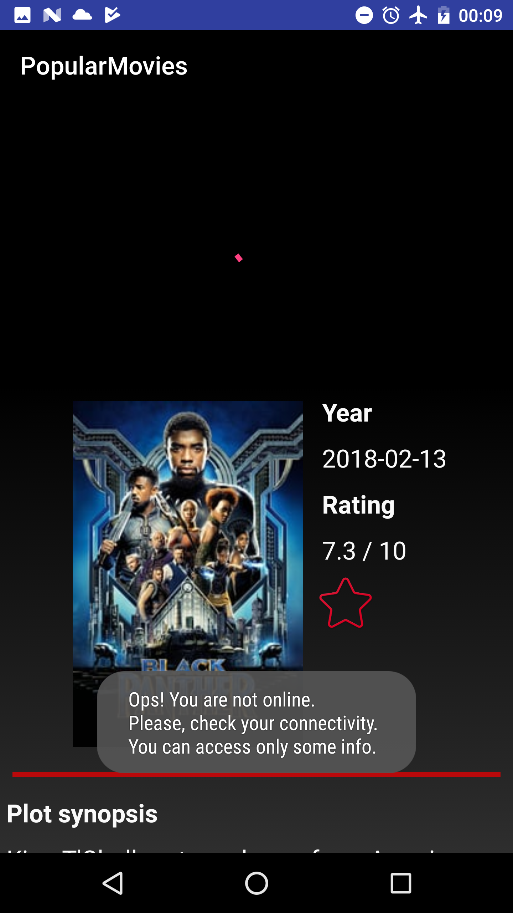
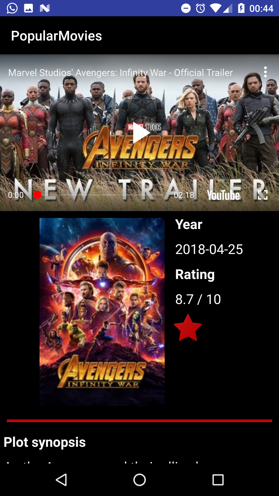
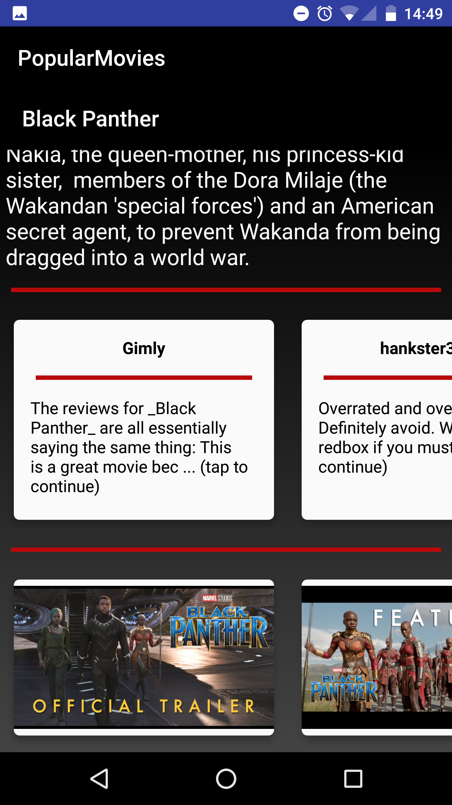
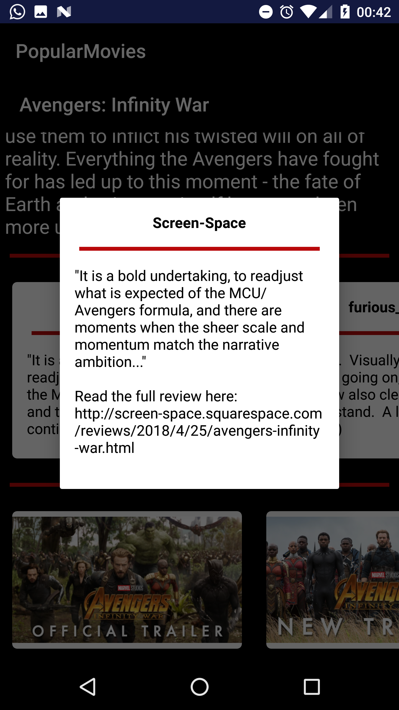

# PopularMovies Project

## Project Overview
In this project, I created the **PopularMovies** app to
show the list of popular/top rated movies and their details.

## Aim of this Project
The  app:

- Presents the user with a grid arrangement of movie posters upon launch;
- Allows your user to change sort order via a spinner;
- Allows the user to tap on a movie poster and transition to a details screen with additional information such as:
	- original title
	- movie poster image thumbnail
	- movie plot
	- user rating (called vote_average in the api)
	- release date
	- movie trailers/videos
	- users reviews

## What Did I Learn?
Through this project, I learned to:
- fetch data from the Internet with theMovieDB API;
- use adapters and custom list layouts to populate list views;
- incorporate libraries to simplify the code (Butterknife, YouTube Data API v3);
- manage the movie's info through a ContentProvider in order to save, delete and retrieve favorite movies;
- save the current state of the app;
- load data by using LoadManager and AsyncTaskLoader;
- manage and design an user-friendly UI by using the CoordinatorLayout, animation, etc.

## Application screenshot for PopularMovies Stage 2
List of popular, top rated movies selected throw a NavigationDrawer

List favorite movies

Error if no internet connection (except for favorite movies because the movie info are saved)

Error if no internet connection (except for favorite movies because the movie info are saved)

Movie details whent the movie is not between the favorites and when it is

Movie's reviews and trailers

Movie's review detail

### Credits

Icons made by <a href="https://www.flaticon.com/authors/smashicons" title="Smashicons">Smashicons</a> from <a href="https://www.flaticon.com/" title="Flaticon">www.flaticon.com</a> is licensed by <a href="http://creativecommons.org/licenses/by/3.0/" title="Creative Commons BY 3.0" target="_blank">CC 3.0 BY</a>

Icons made by <a href="https://www.flaticon.com/authors/smashicons" title="Smashicons">Smashicons</a> from <a href="https://www.flaticon.com/" title="Flaticon">www.flaticon.com</a> is licensed by <a href="http://creativecommons.org/licenses/by/3.0/" title="Creative Commons BY 3.0" target="_blank">CC 3.0 BY</a>

Icons made by <a href="https://www.flaticon.com/authors/good-ware" title="Good Ware">Good Ware</a> from <a href="https://www.flaticon.com/" title="Flaticon">www.flaticon.com</a> is licensed by <a href="http://creativecommons.org/licenses/by/3.0/" title="Creative Commons BY 3.0" target="_blank">CC 3.0 BY</a>
