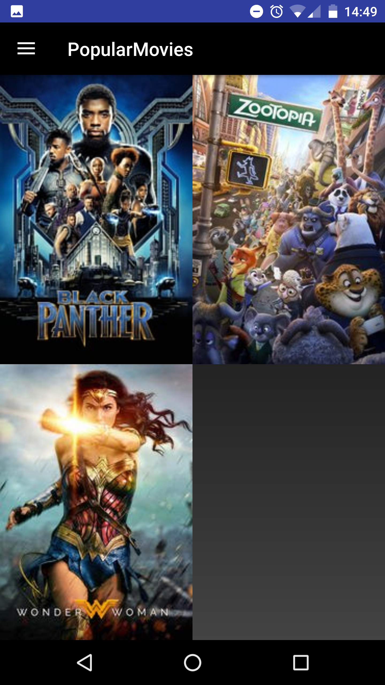

# Sandwich Club Project

## Project Overview
In this project, I created the **PopularMovies** app to
show the list of popular/top rated movies and their details.

## Aim of this Project
The  app:

- Presents the user with a grid arrangement of movie posters upon launch;
- Allows your user to change sort order via a spinner;
- Allows the user to tap on a movie poster and transition to a details screen with additional information such as:
	- original title
	- movie poster image thumbnail
	- movie plot
	- user rating (called vote_average in the api)
	- release date

## What Did I Learn?
Through this project, I learned to:
- fetch data from the Internet with theMovieDB API;
- use adapters and custom list layouts to populate list views;
- incorporate libraries to simplify the code.

## Application screenshot for PopularMovies Stage 1
List of popular movies

List of top rated movies

Movie details

Error if no internet connection

