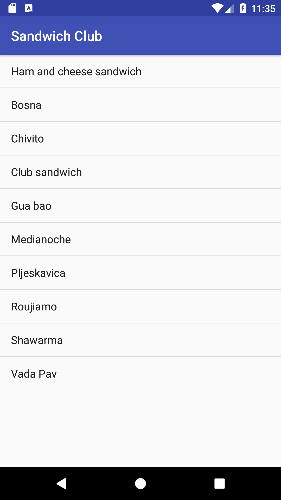
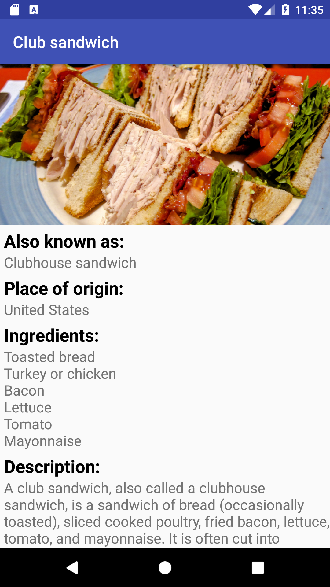
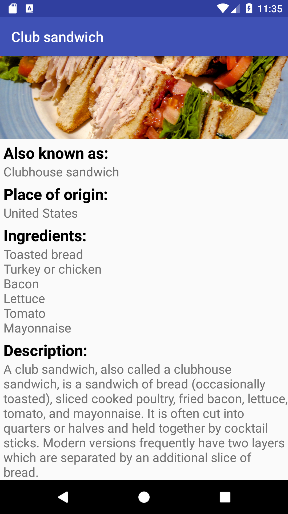

# Sandwich Club Project

## Project Overview
In this project, I completed the **Sandwich Club** app to
show the details of each sandwich once it is selected.

## Aim of this Project
Building a layout and populating its fields from data received as JSON
is a common task for Android Developers. Although JSON parsing is usually
done using libraries, writing the JSON parsing for  this project will
help you to better understand how it is processed.

## What Did I Learn?
Through this project, I:
- Learned how to submit projects for review;
- Practiced JSON parsing to a model object by using JSONObject and JSONArray;
- Designed the detail activity layout;
- Populated all fields in the detail activity and layout so the different elements
are display in a sensible way;
- Managed possibile exceptions and empty strings.

## Application screenshots

Format: 

Format: 

Format: 